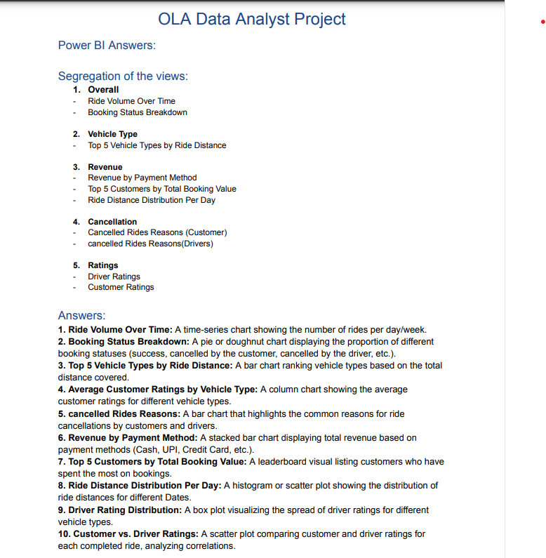

# 🚖 OLA Ride Insights

🚀 This project provides **data-driven insights into ride trends, cancellations, revenue, and customer ratings** using: 

✅ **SQL Queries** – Data extraction & transformation  
✅ **Power BI Dashboard** – Interactive visualizations  
✅ **Excel Processing** – Data cleaning & structuring  

**Domain:** Ride-Sharing & Mobility Analytics

**Skills Takeaway:** SQL querying, data preprocessing, Power BI visualization, Streamlit app development, and business intelligence insights.

## 📌 Problem Statement

The rise of ride-sharing platforms has transformed urban mobility, offering convenience and affordability to millions of users. OLA, a leading ride-hailing service, generates vast amounts of data related to ride bookings, driver availability, fare calculations, and customer preferences. However, deriving actionable insights from this data remains a challenge.

To enhance operational efficiency, improve customer satisfaction, and optimize business strategies, this project focuses on analyzing OLA’s ride-sharing data. By leveraging data analytics, visualization techniques, and interactive applications, the goal is to extract meaningful insights that can drive data-informed decisions.

The project involves cleaning and processing raw ride data, performing exploratory data analysis (EDA), developing a dynamic Power BI dashboard, and creating a Streamlit-based web application to present key findings in an interactive and user-friendly manner.

## 💼 Business Use Cases

- **Peak Demand & Driver Allocation:** Identifying peak demand hours and optimizing driver allocation across locations.
- **Customer Behavior:** Analyzing customer behavior to formulate personalized marketing and engagement strategies.
- **Pricing Patterns:** Understanding pricing trends and evaluating the effectiveness of surge pricing.
- **Anomaly Detection:** Detecting anomalies or fraudulent activities in the ride data.
---

## 🚀 Approach

1. **Data Understanding & Exploration**
   - Load and examine the dataset structure.
   - Identify key variables like ride status, payment method, and ratings.
   - Perform initial exploratory data analysis (EDA).
2. **Data Cleaning & Preprocessing**
   - Handle missing or inconsistent values.
   - Convert data types and standardize formats.
   - Create derived features for better insights.
3. **SQL Query Development**
   - Write queries to extract insights (e.g., ride trends, cancellations, ratings).
   - Optimize queries for performance and accuracy.
   - Validate results against the dataset.
4. **Power BI Dashboard Creation**
   - Design interactive visualizations for ride trends, revenue, and cancellations.
   - Use filters and slicers for dynamic data exploration.
   - Integrate KPIs and metrics for actionable business insights.
5. **Streamlit Application Development**
   - Create a user-friendly UI to display SQL query results.
   - Implement interactive filters and search options.
   - Embed Power BI visuals (or recreate them using Plotly/Streamlit components) into the app for a complete analytics experience.
6. **Project Documentation & Deployment**
   - Document insights, queries, and dashboard explanations.
   - Ensure the Streamlit app is deployed and accessible.
   - Present findings with business-oriented storytelling.

## 📌 Project Overview  
This project analyzes **Ola ride data** to uncover business insights. Key aspects covered:  
✔ **Ride trends & booking status breakdown**  
✔ **Cancellations by customers & drivers**  
✔ **Revenue distribution by payment method**  
✔ **Top customers & vehicle types by ride distance**  
✔ **Customer vs. Driver Ratings**  

📌 **Project Workflow:**  

  

---

## 🛠️ Tools Used  
🔹 **SQL** – For data extraction & querying  
🔹 **Power BI** – For dashboard creation & visualization  
🔹 **Excel** – For data pre-processing  

---

## 🔍 Data Insights & Analysis  

### 📌 SQL Analysis  
✔ Retrieve total successful bookings  
✔ Find the **average ride distance** per vehicle type  
✔ Identify the **top 5 customers** based on rides & booking value  
✔ Analyze **cancellation reasons** from customers & drivers  
✔ Compute **customer & driver ratings distribution**  

📌 **Check the SQL Query Results:**  
📄 **[`SQL Analysis Answers`](./OLA_SQL-ANSWERS.png)**  

---

### 📊 Power BI Dashboard  
Created an **interactive dashboard** to visualize ride data trends:  
📈 **Ride Volume Over Time**  
📊 **Booking Status Breakdown**  
🚗 **Top 5 Vehicle Types by Ride Distance**  
💳 **Revenue by Payment Method**  
⭐ **Customer vs. Driver Ratings**  

📌 **Power BI Dashboard Output:**  
  
📌 **Check the Power BI Dashboard Output:**  
📄 **[`Power BI Dashboard Answers`](./OLA_POWER_BI-ANSWERS.png)**  

---

## 📂 Repository Files  
📄 **[`OLA_DATASET.csv`](./OLA_Ride_Data_Sheet.csv)** – Raw ride dataset  
📝 **`README.md`** – Project details and insights  
🖼 **[`OLA_QUESTIONS.png`](./OLA_QUESTIONS.png)** – Analysis plan & questions  
🖼 **[`OLA_SQL-ANSWERS.png`](./OLA_SQL-ANSWERS.png)** – SQL analysis results  
🖼 **[`OLA_POWER_BI-ANSWERS.png`](./OLA_POWER_BI-ANSWERS.png)** – Power BI dashboard output  
📄 **[`OLA_SQL-ANSWERS.png`](./OLA_SQL-ANSWERS.png)** – SQL analysis results  
📄 **[`OLA_POWER_BI-ANSWERS.png`](./OLA_POWER_BI-ANSWERS.png)** – Power BI dashboard output  

---

## 🚀 How to Use This Project?  
1️⃣ **Download the dataset** – [`OLA_DATASET.csv`](./OLA_Ride_Data_Sheet.csv)  
2️⃣ **Run SQL queries** to extract insights – [`OLA_SQL-ANSWERS.png`](./OLA_SQL-ANSWERS.png)  
3️⃣ **Explore the Power BI dashboard** for visualization.  
3️⃣ **Explore the Power BI dashboard insights** – [`OLA_POWER_BI-ANSWERS.png`](./OLA_POWER_BI-ANSWERS.png)  
